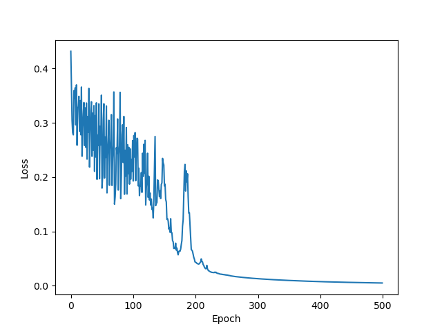
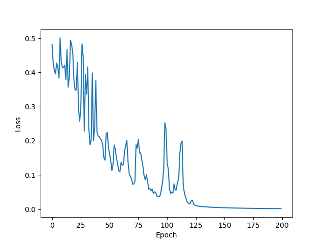

# BuildMLP
Deep Learning Homework - build MLP by meself to solve  8-bit parity check (8BPC）

## Loss Diagram
1. Final loss = **0.005118133**  ??: ReLU(128) $\rightarrow$ Tanh(53) $\rightarrow$ Sigmoid(28) $\rightarrow$ Sigmoid(1)

2. Final loss = **0.001718602**  ??: ReLU(128) $\rightarrow$ Tanh(64) $\rightarrow$ Sigmoid(28)

